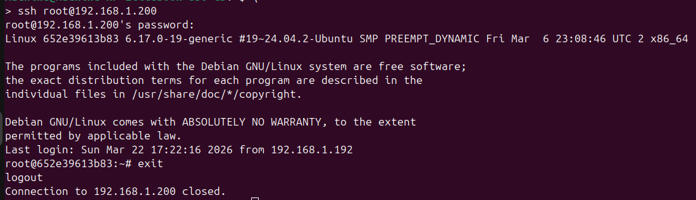

# UnoSoftTest
Docker Compose скрипт для развертки кластера из трех инстансов cassandra.
Каждый инстанс имеет свой ip address для локальной сети.

Перед запуском выполнить скрипт ./setupRoutes.sh:
- ip link add ipvlan0 link wlp1s0 type ipvlan mode l2
- ip addr add 192.168.1.192/28 dev ipvlan0
- ip link set ipvlan0 up
- ip route add 192.168.1.192/28 dev ipvlan0

Создать файл ./ssh_root_password с паролем

Запуск
- docker compose up --build

Доступ по ssh с хоста:

Окатить маршруты ./rollbackRoutes.sh
